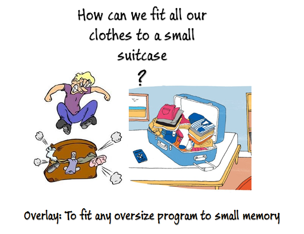

# RISC-V Software Overlay 

  

 
The repostority contains:

- [RT Engine Implementation](/comrv)
- [High Level Design](/docs/overlay-hld.adoc)
- Toolchain github patches:
  - [llvm link](https://github.com/westerndigitalcorporation/llvm-project/tree/comrv)
  - binutils link (TBD)
  - gdb link (TBD)

The implementation is based on [“Overlay Software Standard proposal"](https://github.com/fossi-foundation/embedded-sw-overlay/tree/master/docs)
From FOSSI

Follow `meeting minutes` and status at [tech-overlay task group](https://lists.riscv.org/g/tech-overlay) and/or in [docs](/docs) folder.

